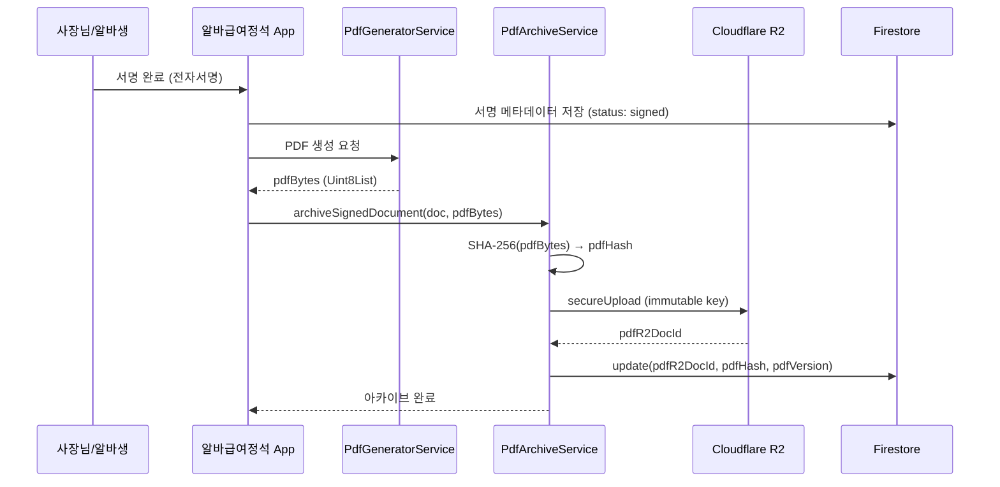
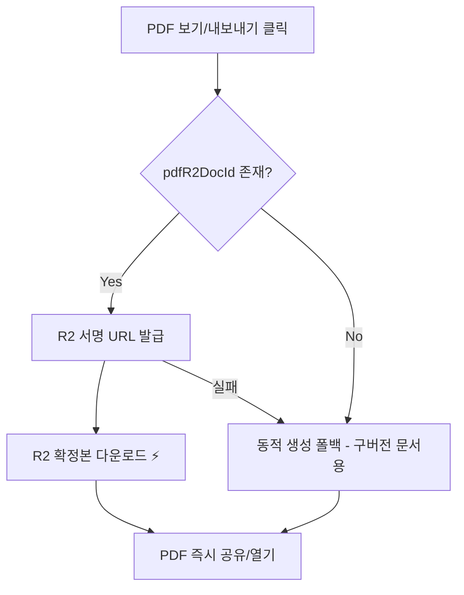
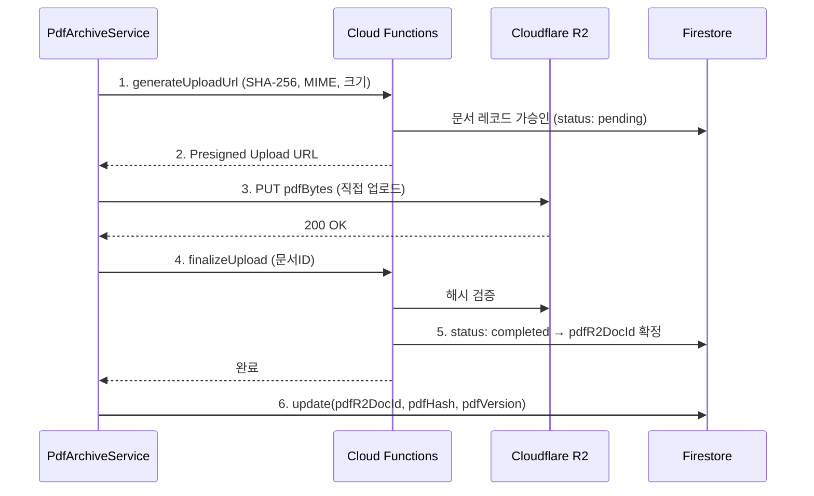
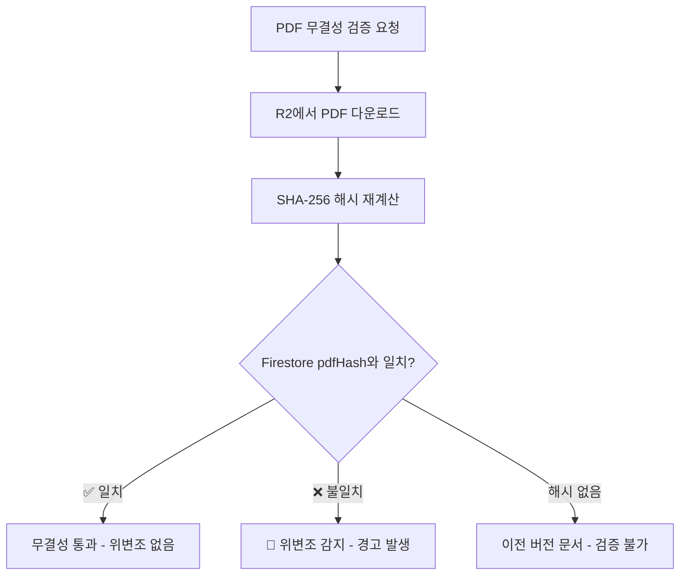

<div style="text-align: right; color: red; font-weight: bold; border: 2px solid red; padding: 10px; margin-bottom: 20px;">
  ⚠️ 대외비 (Confidential) - 무단 배포 및 복제를 금합니다.
</div>

# 알바급여정석 PDF Immutable Archive 시스템

본 문서는 서명 완료된 노무 서류(근로계약서, 임금명세서, 임금변경합의서)를 Cloudflare R2에 **확정 PDF로 영구 보관**하고, SHA-256 해시 기반 **위변조 방지** 체계를 구축한 기술 아키텍처를 설명합니다.

> **핵심 원칙**: PDF는 **R2에만** 저장됩니다. Firebase Storage는 PDF 보관에 사용되지 않습니다. 한번 아카이브된 PDF는 **재생성되지 않으며**, 내보내기/조회 시 R2 확정본을 그대로 다운로드합니다.

---

## 1. 🎯 설계 목적 및 법적 근거

### 1.1 핵심 문제

| 항목 | 변경 전 | 변경 후 |
|------|---------|---------|
| PDF 보관 | ⚠️ 요청 시 동적 렌더링 + Firebase Storage | ✅ **R2에만** immutable 확정본 보관 |
| PDF 재생성 | ⚠️ 내보내기마다 매번 재생성 | ✅ R2 확정본 다운로드 (재생성 금지) |
| PDF 해시 | ❌ 없음 | ✅ SHA-256 해시 Firestore 저장 |
| 감사 메타데이터 | ⚠️ `signedAt` 있으나 불완전 | ✅ signedAt / signedBy / ip / userAgent / pdfHash 기반 강화 |
| PDF 버전 관리 | ❌ 없음 | ✅ v1, v2… 수정 시 새 버전 (overwrite 금지) |
| 문서 수정 정책 | ⚠️ 수정 가능 | ✅ signed 상태 immutable (확정 후 변경 차단) |
| 삭제 정책 | 🔴 hard delete | ✅ soft delete (논리 삭제) |
| 보관 기간 | ❌ 미정의 | ✅ 관련 노동관계법령 보존의무 고려 최소 3년 |

### 1.2 법적 근거

| 문서 종류 | 근거 법령 | 보관 기간 |
|-----------|----------|----------|
| 근로계약서 | 근로기준법 제42조 | 3년 |
| 임금명세서 | 근로기준법 제48조 | 3년 |
| 임금대장 | 근로기준법 제48조 | 3년 |

> **참고**: 문서 종류에 따라 보관 기간이 다를 수 있으므로, 유형별 분리가 가능하도록 설계되어 있습니다. 향후 법령 변경 시 `PdfArchiveService.calculateRetentionUntil()` 메서드에서 유형별 기간을 조정할 수 있습니다.

---

## 2. 🏗️ 시스템 아키텍처

### 2.1 전체 흐름



### 2.2 PDF 조회/내보내기 흐름 (R2 우선, 재생성 금지)



> **중요**: R2에 확정본이 있으면 **절대 재생성하지 않고** 원본을 그대로 사용합니다. 동적 생성은 R2 아카이브 이전에 생성된 구버전 문서에 대해서만 폴백으로 동작합니다.

---

## 3. 📦 R2 아카이브 대상 문서

| # | 문서 타입 | DocumentType | 아카이브 시점 | 상태 |
|---|----------|-------------|-------------|------|
| 1 | 표준 근로계약서 (풀타임) | `contract_full` | 알바생 서명 완료 시 | ✅ |
| 2 | 단시간 근로계약서 (파트) | `contract_part` | 알바생 서명 완료 시 | ✅ |
| 3 | 임금명세서 | `wageStatement` | 발송 즉시 | ✅ |
| 4 | 임금변경합의서 | `wage_amendment` | 교부 즉시 | ✅ |

### 3.1 아카이브 트리거별 상세

#### 근로계약서 (contract_full / contract_part)

**트리거 1**: `DocumentSigningScreen._handleSign()` — 알바생 서명 완료 시  
**트리거 2**: `generateAndUploadFinalPdf()` — 교부 시

```
1. 알바생 전자서명 → signatureUrl 저장
2. SecurityMetadataHelper.captureMetadata() → IP, 기기, GPS 기록
3. LaborDocument(status: 'signed') Firestore 저장
4. ★ PdfGeneratorService.generateFullContract() → pdfBytes
5. ★ PdfArchiveService.archiveSignedDocument() → R2 업로드
```

> **핵심**: 사장님 서명(1차)과 알바생 서명(2차) 양쪽이 모두 포함된 **확정본 PDF**를 생성하여 아카이브합니다. Firebase Storage에는 업로드하지 않으며, R2가 유일한 PDF 보관소입니다. R2 아카이브 실패는 별도 catch로 처리되어 교부 프로세스에 영향을 주지 않습니다.

#### 임금명세서 (wageStatement)

**트리거 1**: `PayrollDashboardScreen` — 전직원 일괄 발송 시  
**트리거 2**: `PayrollReportPage` — 개별 직원 발송 시

```
1. 급여 정산 완료 → payrollData 구성
2. LaborDocument(status: 'sent', retentionUntil: +3년) Firestore 저장
3. ★ PdfGeneratorService.generateWageStatement() → pdfBytes
4. ★ PdfArchiveService.archiveSignedDocument() → R2 업로드
```

#### 임금변경합의서 (wage_amendment)

**트리거**: `WageAmendmentScreen._handleIssuance()` — 교부 시

```
1. 사장님 서명 + 알바생 서명 완료 → status: 'signed'
2. 교부 클릭 → 무결성 해시 생성
3. ★ PdfGeneratorService.generateWageAmendment() → pdfBytes
4. ★ PdfArchiveService.archiveSignedDocument() → R2 업로드
5. 직원 시급/월급 자동 업데이트 + 임금 변경 히스토리 기록
```

> **특이사항**: 교부 시 직원의 `hourlyWage`/`monthlyWage`와 `wageHistoryJson`이 자동 업데이트되며, 변경 전/후 임금이 PDF에 확정 기록됩니다.

---

## 4. 🔐 보안 아키텍처

### 4.1 Immutable 정책 (signed 문서 변경 차단)

Firestore 보안 규칙에서 `signed` 상태 문서의 핵심 필드 변경을 차단합니다.

**차단 대상 필드** (사장님 포함 전원):
| 필드 | 이유 |
|------|------|
| `pdfHash` | PDF 위변조 방지 |
| `pdfR2DocId` | 아카이브 참조 보호 |
| `documentHash` | 문서 무결성 해시 보호 |
| `content` | 계약 본문 변경 차단 |
| `dataJson` | 구조화 데이터 변경 차단 |

**직원 서명 시 추가 차단 필드**:
- `pdfVersion`, `pdfR2DocId`, `pdfHash` (아카이브 메타)
- `bossSignatureUrl`, `bossSignatureMetadata` (사장님 서명)
- `content`, `dataJson`, `documentHash` (법적 증빙)

### 4.2 Soft Delete 정책

```
// 변경 전: hard delete (물리 삭제)
await _db.doc(docId).delete();  // ← 복구 불가

// 변경 후: soft delete (논리 삭제)
await _db.doc(docId).update({
  'isDeleted': true,
  'deletedAt': DateTime.now().toIso8601String(),
  'deletedBy': uid,
});
```

| 규칙 | 설명 |
|------|------|
| signed 문서 hard delete | ❌ Firestore 보안 규칙에서 차단 |
| wage_* 문서 삭제 | ❌ 기존 정책 유지 (변조 방지) |
| draft/sent 문서 삭제 | ✅ 사장님만 가능 |
| 문서 목록 조회 | `isDeleted == true` 문서 자동 필터링 |

### 4.3 Hard Delete 차단 보안 규칙

```javascript
// firestore.rules
allow delete: if isStoreOwner(storeId)
  && !docId.matches('wage_.*')
  && resource.data.get('status', '') != 'signed';
```

---

## 5. 📊 데이터 모델 (LaborDocument 확장)

### 5.1 신규 필드

```dart
// ── PDF Immutable Archive (R2 확정본) ──
final String? pdfR2DocId;       // R2 문서 ID (서명 완료 시 생성)
final String? pdfHash;          // PDF 파일의 SHA-256 해시
final int pdfVersion;           // PDF 버전 (수정 시 v2, v3… overwrite 금지)

// ── Soft Delete ──
final bool isDeleted;           // soft delete 플래그
final DateTime? deletedAt;      // 삭제 시점
final String? deletedBy;        // 삭제한 사용자 UID

// ── Retention 정책 ──
final DateTime? retentionUntil; // 보관 만료일 (기본: createdAt + 3년)
```

### 5.2 Firestore 문서 구조 (signed 상태 예시)

```json
{
  "id": "contract_abc123",
  "staffId": "staff_001",
  "storeId": "store_xyz",
  "type": "contract_full",
  "status": "signed",
  "title": "표준 근로계약서",
  "content": "...",
  "dataJson": "{...}",
  "createdAt": "2026-05-11T10:00:00Z",
  "signedAt": "2026-05-11T14:30:00Z",
  "sentAt": "2026-05-11T12:00:00Z",
  "deliveryConfirmedAt": "2026-05-11T14:30:00Z",

  "documentHash": "a3f2b8c1...sha256...",

  "bossSignatureUrl": "https://...",
  "bossSignatureMetadata": {
    "timestamp": "2026-05-11T12:00:00Z",
    "device": "iPhone 15 Pro",
    "deviceId": "ABC-123",
    "ipAddress": "192.168.1.100",
    "gps": "37.5665, 126.9780",
    "role": "owner"
  },

  "signatureUrl": "https://...",
  "signatureMetadata": {
    "employee": {
      "timestamp": "2026-05-11T14:30:00Z",
      "device": "Galaxy S24",
      "deviceId": "XYZ-789",
      "ipAddress": "192.168.1.101",
      "gps": "37.5665, 126.9781",
      "role": "employee"
    }
  },

  "pdfR2DocId": "r2_doc_uuid_v1",
  "pdfHash": "e7b9a4d2...sha256...(PDF 파일 해시)",
  "pdfVersion": 1,

  "isDeleted": false,
  "retentionUntil": "2029-05-11T10:00:00Z"
}
```

---

## 6. 🔧 핵심 서비스 API

### 6.1 PdfArchiveService

| 메서드 | 설명 |
|--------|------|
| `archiveSignedDocument(doc, pdfBytes)` | 서명 후 PDF 확정 보관 (SHA-256 → R2 → Firestore) |
| `getArchivedPdfUrl(doc)` | 보관된 PDF의 서명 다운로드 URL 반환 |
| `verifyPdfIntegrity(doc, pdfBytes)` | 해시 대조 위변조 검증 (true/false/null) |
| `calculateRetentionUntil(doc)` | 문서 유형별 보관 만료일 계산 |
| `calculatePdfHash(pdfBytes)` | PDF 바이트의 SHA-256 해시 생성 |

### 6.2 R2 Object Key 규칙

```
documents/{storeId}/{docId}_v{version}.pdf
```

예시:
```
documents/store_xyz/contract_abc123_v1.pdf   ← 최초 서명
documents/store_xyz/contract_abc123_v2.pdf   ← 수정 시 새 버전
```

> **핵심 원칙**: 동일 키에 대한 overwrite는 절대 금지. 수정 시 반드시 새 버전 키를 생성합니다.

---

## 7. ⚡ R2 업로드 파이프라인

기존 `R2StorageService.secureUpload()` 인프라를 활용한 2-step commit:



---

## 8. 🧪 무결성 검증 흐름

PDF 위변조 여부를 확인하는 3단계 검증:



### 검증 코드
```dart
final isValid = PdfArchiveService.instance.verifyPdfIntegrity(
  doc: document,
  downloadedPdfBytes: pdfBytes,
);

switch (isValid) {
  case true:  // ✅ 무결성 통과
  case false: // 🔴 위변조 감지
  case null:  // ⚠️ 해시 미생성 (이전 버전)
}
```

---

## 9. 📂 관련 파일 목록

| 파일 | 역할 |
|------|------|
| `shared_logic/lib/src/services/pdf_archive_service.dart` | R2 아카이브 핵심 서비스 |
| `shared_logic/lib/src/models/document_model.dart` | LaborDocument 모델 (확장 필드) |
| `shared_logic/lib/src/services/database_service.dart` | soft delete + archive 업데이트 |
| `shared_logic/lib/src/services/r2_storage_service.dart` | R2 2-step 업로드 인프라 |
| `shared_logic/lib/src/utils/security_metadata_helper.dart` | 서명 메타데이터 + SHA-256 해시 |
| `boss_mobile/lib/utils/pdf/pdf_generator_service.dart` | PDF 생성 (8종) + 교부 R2 아카이브 |
| `boss_mobile/lib/screens/alba/documents/document_signing_screen.dart` | 계약서 서명 + 아카이브 |
| `boss_mobile/lib/screens/payroll/payroll_dashboard_screen.dart` | 임금명세서 일괄 아카이브 |
| `boss_mobile/lib/screens/payroll_report_page.dart` | 임금명세서 개별 아카이브 |
| `boss_mobile/lib/screens/documents/wage_amendment_screen.dart` | 임금변경합의서 교부 + R2 아카이브 |
| `boss_mobile/lib/screens/documents/document_export_page.dart` | PDF 내보내기 (R2 우선, 재생성 금지) |
| `firestore.rules` | signed immutable + hard delete 차단 |

---

## 10. 🔮 향후 확장 계획

| 항목 | 설명 | 우선순위 |
|------|------|---------|
| 추가 문서 아카이브 | 야간동의서, 근로자명부 등 | 중 |
| 만료 문서 자동 정리 | `retentionUntil` 경과 문서 Cloud Function 배치 삭제 | 낮 |
| 바이러스 스캐닝 | 업로드 PDF에 대한 ClamAV 비동기 검사 | 낮 |
| PDF 뷰어 내장 | R2 URL을 앱 내 WebView에서 직접 표시 | 중 |
| 감사 로그 대시보드 | 문서별 접근/다운로드 이력 시각화 | 낮 |
| 증빙 검증 UI | SHA-256 해시 대조 원클릭 검증 도구 | 중 |

---

<div style="text-align: center; color: grey; font-size: 12px; margin-top: 40px;">
  알바급여정석 v2.0 · PDF Immutable Archive System · 2026-05-11
</div>
