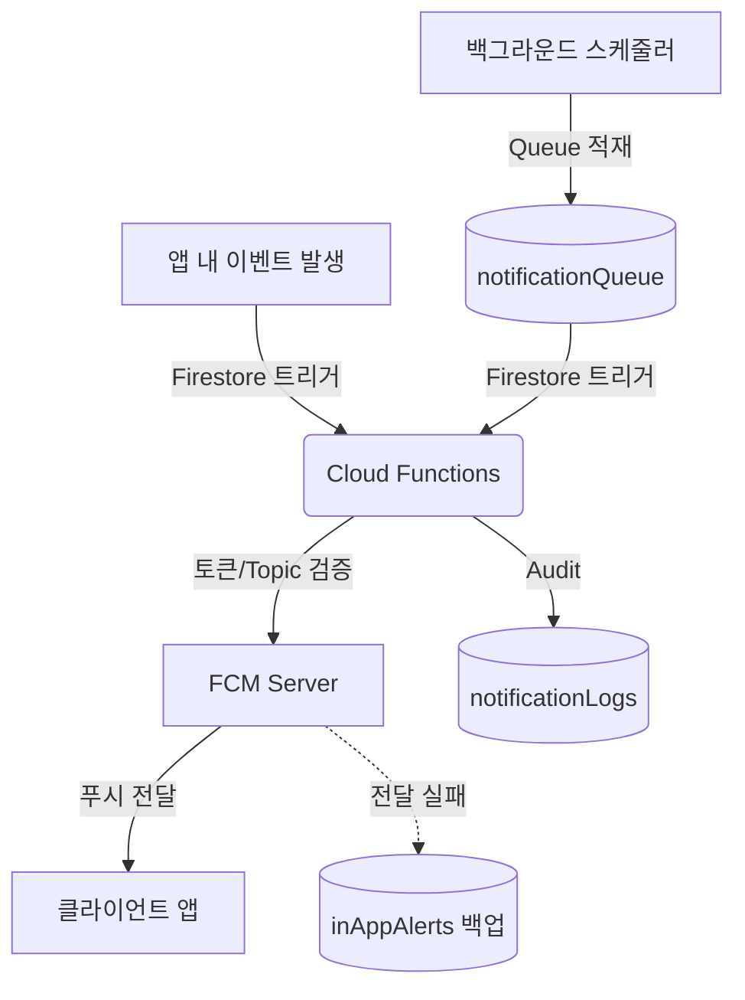

  ⚠️ 대외비 (Confidential) - 무단 배포 및 복제를 금합니다.

# 알바급여정석 푸시 알림 시스템 기술 문서 (Push Notification System)

본 문서는 사장님앱 및 알바생앱 간의 실시간 이벤트 동기화를 위해 구축된 **푸시 알림 시스템**의 아키텍처, 핵심 기능, 그리고 성능 및 UX 향상을 위해 적용된 17가지 필수 설계 패턴(TOP 10 + 추가 7)을 설명합니다.

---

## 1. 시스템 개요 (Architecture Overview)

푸시 알림 시스템은 Firebase Cloud Messaging (FCM)과 Cloud Firestore를 기반으로 동작하며, 크게 두 가지 패턴으로 알림을 처리합니다.

1. **이벤트 기반 직접 푸시**: Firestore 데이터 변경(출퇴근, 공지사항 등) 시 Cloud Functions가 즉각적으로 이벤트를 감지하여 발송합니다.
2. **큐(Queue) 기반 비동기 푸시**: 서류 요청, 보건증 만료 등 다양한 시스템에서 `notificationQueue` 컬렉션에 문서를 적재하면 중앙화된 스케줄러가 이를 처리하여 발송합니다.

---

## 2. 주요 발송 트리거 (Triggers & Types)

| 종류 | Cloud Function | 발송 대상 | 발송 조건 | 라우팅 (Deep Link) |
|---|---|---|---|---|
| **이상 출근** | `sendAttendanceCreatedPush` | 사장님 (`topic`) | 무단 출근, 지각 감지 | `/attendance` |
| **이상 퇴근** | `sendAttendancePush` | 사장님 (`topic`) | 조기 퇴근 요청, 연장 근무 신청 | `/attendance` |
| **공지사항** | `sendNoticePush` | 전체 알바생 (`topic`) | 사장님이 새 공지 등록 시 | `/notices` |
| **대근 신청** | `sendSubstitutionPush` | 사장님 (`topic`) | 알바생 대근 신청/승인 시 | `/substitution` |
| **기타 (Queue)** | `processNotificationQueue` | 개인/그룹 | 서류 요청, 보건증 만료 임박 등 | 발송 타입별 상이 |

---

## 3. 핵심 설계 원칙 및 적용 기술 (The 17 Principles)

안정적이고 효율적인 푸시 시스템을 위해 적용된 17가지 핵심 설계 패턴입니다.

### 🛡️ 보안 및 안전성 (Safety & Reliability)

1. **중복 푸시 방지 (Deduplication)**
   - 이벤트 트리거 시 `before`와 `after` 상태를 엄밀하게 비교합니다. (예: `before.clockOut == null && after.clockOut != null`)
   - 큐 기반 알림은 고유 식별자(`dedupeKey`)와 엄격한 상태 검증(`status !== 'queued'`)을 통해 다중 발송을 원천 차단합니다.
2. **Queue 상태 머신 (State Machine)**
   - `queued` → `processing` → `sent` / `failed` 상태로 트랜잭션을 관리하여 동시성 문제를 해결합니다.
3. **재시도 메커니즘 (Retry Policy)**
   - 발송 실패 시 최대 3회(`MAX_RETRY`)까지 재시도하며, 실패 시간과 사유(`lastError`)를 기록합니다.

### 📱 토큰 및 구독 관리 (Lifecycle Management)

4. **FCM 토큰 자동 정리 (Token Cleanup)**
   - 발송 시 `messaging/registration-token-not-registered` 에러 발생 시 데이터베이스에서 해당 토큰을 즉각 삭제하여 불필요한 발송을 줄입니다.
5. **Topic 구독 해제 (Unsubscribe on Logout)**
   - 직원이 퇴사하거나 사용자가 로그아웃(`boss_logout.dart`)할 때 반드시 기존 Topic(`_boundTopic`, `_boundWorkersTopic`)을 구독 해제하고 서버 토큰을 제거합니다.
6. **앱 종료 상태 지원 (Background Handler)**
   - `@pragma('vm:entry-point')`를 사용하는 Top-level 백그라운드 핸들러를 등록하여 앱이 완전히 종료된 상태에서도 알림을 처리하고 시스템 트레이에 표시합니다.

### 🚀 성능 및 비용 최적화 (Performance & Cost)

7. **비용 최적화 (Firestore Triggers)**
   - 클라이언트 측의 무거운 Realtime Stream 감지 대신 Cloud Functions 백엔드 트리거만 사용하여 Firestore 읽기 비용을 극적으로 낮췄습니다.
8. **Batch 발송 (sendEachForMulticast)**
   - 여러 개의 기기(토큰)를 가진 사용자에게 알림을 보낼 때 반복문 대신 FCM의 Multicast 기능을 사용하여 발송 성능을 높였습니다.
9. **리전 고정 (Region Optimization)**
   - 모든 알림 관련 Cloud Functions를 앱 주 사용 지역인 서울(`asia-northeast3`)에 배치하여 Latency를 최소화했습니다.
10. **타임아웃 및 메모리 최적화 (Timeout & Memory)**
    - 큐 프로세서(`processNotificationQueue`)에 명시적으로 `timeoutSeconds: 120`, `memory: "256MiB"`를 설정하여 OOM(Out of Memory)과 과도한 실행 시간을 방지합니다.

### 🧠 사용자 경험 (UX)

11. **사전 동의 다이얼로그 (Permission UX)**
    - 앱 진입 시 즉시 권한을 요청하지 않고, 푸시 알림의 필요성(이상 근태, 보건증 만료 등 안내)을 먼저 다이얼로그로 설명한 후 OS 권한 팝업을 호출합니다.
12. **딥링크 라우팅 (Deep Link Routing)**
    - 알림 Payload에 `route` 데이터를 포함하여 사용자가 푸시를 탭했을 때 알림 성격에 맞는 화면(출퇴근표, 공지사항, 서류함 등)으로 즉시 이동(`navigatorKey` 활용)시킵니다.
13. **Collapse Key (알림 덮어쓰기)**
    - 동일한 종류의 알림(예: 여러 명의 근태 알림)이 짧은 시간에 오면 알림 센터가 도배되지 않도록 최신 알림으로 덮어씁니다. (`android.collapseKey`, `apns-collapse-id` 설정)

### 📊 감사 및 장애 대응 (Audit & Fallback)

14. **Audit Log 구축 (notificationLogs)**
    - 발송된 모든 알림의 종류, 대상, 성공/실패 여부를 `notificationLogs` 컬렉션에 남겨 향후 분쟁이나 고객 CS 시 근거 자료로 활용합니다.
15. **로그 수명 주기 관리 (Log Lifecycle)**
    - 매일 새벽 4시에 `cleanupNotificationLogs` 스케줄러가 동작하여 90일이 지난 Audit Log와 30일이 지난 Queue 데이터를 자동 삭제하여 DB 무한 증가를 방지합니다.
16. **Rate Limit (스팸 방지)**
    - 특정 사용자에게 1분간 최대 20건의 푸시만 허용하도록 `checkRateLimit()`를 구현하여 악의적이거나 시스템 오류로 인한 '푸시 폭탄'을 막습니다. (초과 시 상태: `rate_limited`)
17. **장애 Fallback (In-App Badge)**
    - 기기 문제나 네트워크 이유로 FCM 토큰 발송이 100% 실패할 경우, 해당 메시지를 `inAppAlerts` 컬렉션에 우회 저장합니다.
    - 클라이언트 앱은 `unreadAlertCount` 스트림을 구독하여, 푸시를 받지 못했더라도 앱을 열면 앱 내 알림 뱃지로 확인할 수 있도록 보완합니다.

---

## 4. 클라이언트 핸들러 흐름 (Client Flow)

`PushService` (위치: `lib/services/push_service.dart`)가 전체 흐름을 관장합니다.

1. **초기화**: `main.dart` 의 `_AuthGate`에서 로그인 성공 시 `initializeHandlers()` 호출.
2. **권한 요청**: `requestPermissionWithExplanation()` 을 통해 권한 확보.
3. **바인딩**: 사장님(`bindBossPush`) 또는 알바생(`bindWorkerPush`) 역할에 따라 해당 매장의 Topic 구독 및 토큰 서버 전송.
4. **포그라운드 수신**: 앱 실행 중 알림 도착 시 `ScaffoldMessenger`를 통해 자체 제작한 SnackBar 배너 노출.
5. **백그라운드/종료 수신 탭**: OS 시스템 트레이에서 알림을 탭하면 `onNotificationTap` 콜백이 실행되어 지정된 화면으로 딥링크 이동 처리.
6. **언바인딩**: 로그아웃 시 `unbindPush()` 호출하여 Topic 및 서버 토큰 정리.
