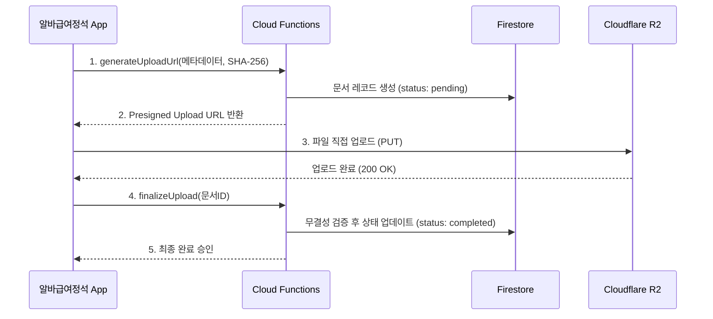

  ⚠️ 대외비 (Confidential) - 무단 배포 및 복제를 금합니다.

# 알바급여정석 R2 보안 스토리지 아키텍처 (Secure Storage Architecture)

본 문서는 Cloudflare R2 스토리지를 활용하여 노무 문서(근로계약서, 보건증 등)와 증빙 자료를 안전하고 효율적으로 관리하기 위한 **무결성 기반 스토리지 아키텍처 가이드라인**입니다. 
안정성, 비용 절감, 그리고 가장 중요한 **법적 증빙(Compliance) 및 보안**을 충족하기 위한 10대 핵심 규칙을 정의합니다.

---

## 1. 🚀 2단계 업로드 확정 모델 (finalizeUpload)

단순 Presigned URL 발급 시 발생할 수 있는 "파일만 존재하고 DB는 없는" 고아(Orphan) 파일 문제와 상태 불일치를 해결하기 위한 필수 흐름입니다.

1. **Upload URL 발급 (`generateUploadUrl`)**: 앱이 Cloud Functions에 업로드할 파일의 메타데이터(크기, MIME 타입, SHA-256 해시)를 전달하고 Presigned URL을 발급받습니다. 이때 Firestore에는 `status: 'pending'`으로 레코드가 가승인됩니다.
2. **직접 업로드 (Direct Upload)**: 앱이 R2로 파일을 직접 전송합니다.
3. **업로드 확정 (`finalizeUpload`)**: 앱 업로드 완료 후, Functions를 호출하여 정상 완료를 알립니다.
4. **DB Commit**: Functions가 R2에 실제 파일이 존재하는지, 해시가 일치하는지 확인한 후 DB 상태를 `status: 'completed'`로 최종 Commit 합니다.

---

## 2. 🛡️ 노무 문서 무결성 및 보안 (Integrity & Security)

법적 효력을 갖는 문서의 위변조를 막고 접근을 통제합니다.

*   **SHA-256 해시 저장 (강력 권장)**
    *   특히 근로계약서 등 노무 문서는 업로드 시 원본 파일의 SHA-256 해시값을 추출하여 DB에 저장합니다.
    *   이후 문서 검증 시 DB의 해시값과 실제 파일의 해시값을 대조하여 **전자문서 무결성**을 100% 보장합니다.
*   **권한 재검증 (Strict Authorization)**
    *   비공개 문서(계약서, 보건증 등)의 다운로드 URL(`generateDownloadUrl`)을 요청할 때, 서버에서 반드시 요청자의 **매장 소속 여부(Store Membership), 직급(Role), 소유권(Owner)**을 재검증합니다.
*   **Signed Download URL 수명 최소화**
    *   CDN을 통한 영구 공개 URL을 사용하지 않고, 요청 시점에만 발급되는 짧은 수명의 Signed URL을 사용합니다.
    *   특히 민감한 노무 문서의 경우 URL 유효기간을 **1분 ~ 5분**으로 극도로 짧게 설정하여 링크 유출로 인한 피해를 막습니다.

---

## 3. 🚦 데이터 검증 및 제한 (Validation & Quota)

클라이언트의 요청을 절대 신뢰하지 않고, 서버 단에서 철저하게 필터링합니다.

*   **MIME Whitelist 검증**
    *   악성 스크립트나 실행 파일 업로드를 막기 위해 서버에서 파일 타입을 화이트리스트로 검사합니다.
    *   허용 예시: `application/pdf`, `image/jpeg`, `image/webp`, `image/png`
*   **Object Size (용량) 검증**
    *   `generateUploadUrl` 단계에서 사전 크기를 검증하고, R2 정책(Policy) 수준에서도 최대 파일 크기(Maximum Content-Length)를 제한하여 악의적인 대용량 파일 폭탄을 방어합니다.
*   **프랜차이즈별 Storage Quota (할당량)**
    *   비용 통제를 위해 사업장(프랜차이즈)별로 사용 가능한 총 스토리지 용량(Quota) 제한을 둡니다.

---

## 4. 🗂️ 메타데이터 및 추적 (Tracking & Standardization)

*   **Audit Metadata 의무화**
    *   문서의 추적성을 위해 DB에 다음 항목을 반드시 기록합니다.
        *   `uploadedBy`: 업로드한 사용자 UID
        *   `uploadedAt`: 업로드 서버 시간 (ServerTimestamp)
        *   `ip`: 업로드 요청 IP (Cloud Functions `req.ip`)
        *   `userAgent`: 기기 정보
*   **Naming Standard (명명 규칙)**
    *   R2 버킷 내 객체 키(Object Key)는 철저한 규칙을 따릅니다.
    *   경로 예시: `stores/{storeId}/documents/{docType}/{YYYY-MM}/{UUID}.ext`
    *   이름만으로 소유권과 문서 종류를 즉시 식별하고 파티셔닝할 수 있어야 합니다.

---

## 5. 🔮 미래 확장 고려 (Future Scope)

*   **Virus Scanning (바이러스 검사)**
    *   현재 단계에서는 오버엔지니어링일 수 있으나, 플랫폼이 성장하여 불특정 다수의 첨부파일을 받을 경우, 업로드 완료 직후 ClamAV 등을 통한 비동기 바이러스 스캐닝 파이프라인 도입을 설계에 남겨둡니다.

---

## 6. 전체 R2 통신 시퀀스 다이어그램

