# 알바급여정석 사장님용 사용 설명서

본 설명서는 알바급여정석 사장님 앱의 기본 사용법과 주요 기능들을 스크린샷과 함께 안내합니다.

 

# [ 제1부. 초기 필수 세팅 및 근로계약 ]

## 1. 시작하기 (로그인 및 회원가입)

앱을 처음 실행하시면 만나게 되는 화면입니다. 
알바급여정석은 별도의 복잡한 회원가입 양식 없이, 기존에 사용하시던 소셜 계정으로 3초 만에 간편하게 로그인하실 수 있습니다.

  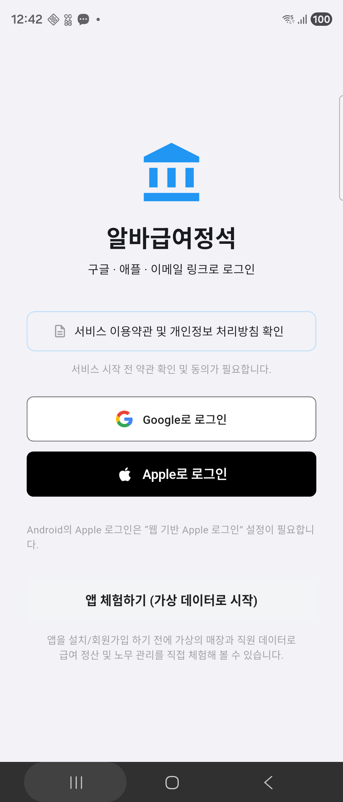

### 🔹 필수 약관 동의
소셜 로그인 버튼을 누르기 전, 개인정보보호법에 의거한 **[서비스 이용약관 및 개인정보 처리방침]** 확인이 우선되어야 합니다.
- `서비스 이용약관 및 개인정보 처리방침 확인` 버튼을 누르면 상세 약관 내역이 표시됩니다.
- 각 필수 약관에 체크(V)하신 후 **[동의하고 시작하기]**를 눌러주시면 기능이 활성화됩니다.
- 한 번 동의하신 이후에는 앱을 지울 때까지 다시 묻지 않습니다.

### 🔹 간편 로그인 방식 지원
- **Google로 로그인**: 구글 계정을 통해 즉시 연동됩니다.
- **Apple로 로그인**: 애플 기기 및 안드로이드 기기에서도 애플 ID로 로그인이 가능합니다.

---

> [!TIP]
> **아직 가입하기 망설여지시나요? "앱 체험하기" 모드를 활용해보세요!**
> 화면 최하단의 `[앱 체험하기 (가상 데이터로 시작)]` 버튼을 누르면 회원가입 없이 가상의 매장과 직원 데이터(5인)가 자동으로 세팅되어 실제 급여 정산과 노무 서류 관리 기능을 100% 동일하게 미리 경험해 보실 수 있습니다!

---

## 2. 사업장 정보 등록 (처음 1회 필수)

로그인 후 가장 먼저 해야 할 일은 사장님의 '매장 정보'를 등록하는 것입니다. 이 정보는 추후 근로계약서, 임금명세서 등 각종 노무 서류 생성 시 자동으로 입력됩니다.

  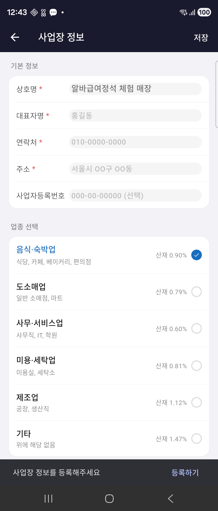
  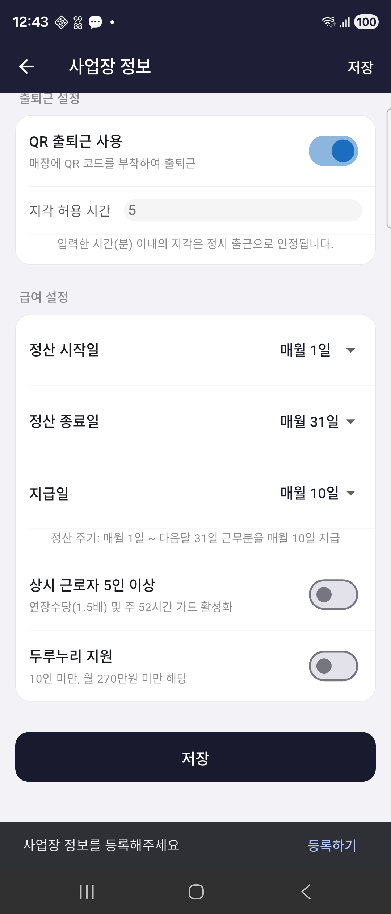

### 🔹 주요 입력 항목 설명
정확한 급여 계산 및 컴플라이언스를 위해 다음 항목들을 신중히 선택해 주세요:

1. **상시 근로자 수 설정 (가장 중요!)**
   - **자동 스캔(추천)**: 앱에 등록된 직원들의 근무표를 바탕으로 5인 이상/미만 여부를 시스템이 매주 자동으로 계산합니다.
   - 근로기준법상 5인 이상과 미만은 **연장수당, 야간/휴일수당, 연차휴가 발생** 등 급여 계산 로직에 결정적인 영향을 미치므로 가급적 [자동 스캔]을 권장합니다.
2. **급여 정산일**
   - **정산 산정 기간 (시작일 ~ 종료일)**: (예) 1일부터 말일까지.
   - **급여 지급일**: 실제 직원들에게 통장 입금하는 날.
   - 위 설정에 따라 매월 급여 명세서가 자동으로 잘려서 산출됩니다.
3. **주휴 수당 표시 여부**
   - 사장님 전용 대시보드에서 주휴 수당 내역을 숨길지, 보여줄지 취향에 따라 선택할 수 있습니다. 
   - 끄더라도 급여 정산 화면에 들어가면 정상 작동 및 내역이 유지됩니다.

> [!IMPORTANT]
> **사업자 등록증 촬영 및 정보 연동**
> 노무 서류(계약서류 등) 하단에는 사장님의 사업자등록번호와 서명이 들어갑니다. [서류 등록/촬영] 버튼을 통해 명확한 정보를 등록해 두시면 서류 자동 완성에 큰 도움이 됩니다.

---

## 3. 신규 직원 등록

급여 정산의 핵심인 직원 근무표를 등록하는 화면입니다. 여러 부가 기능들(사회보험, 보건증)이 숨겨져 있어 상황에 맞게 펼쳐서 설정할 수 있습니다.

  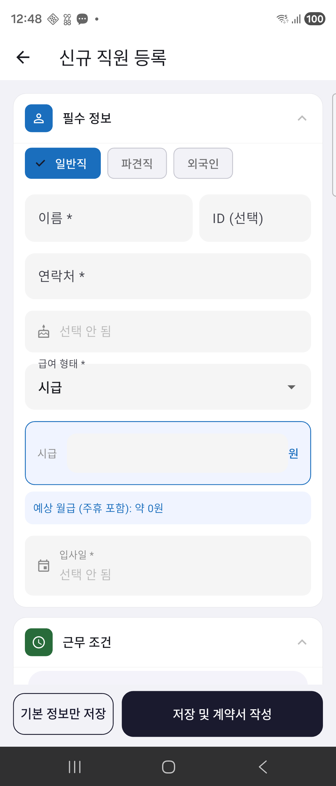
  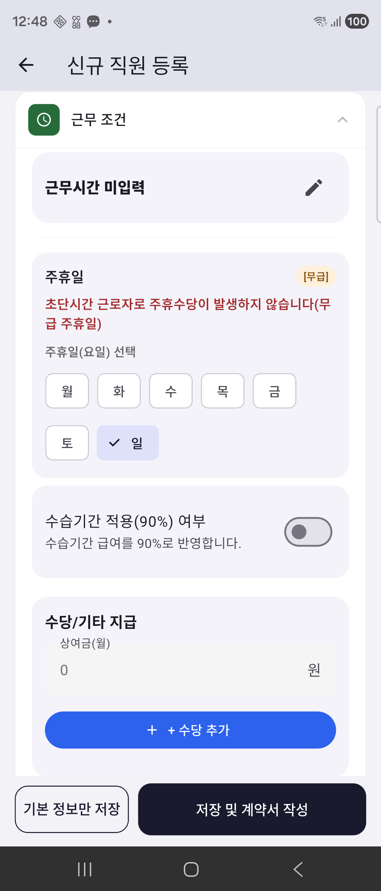
  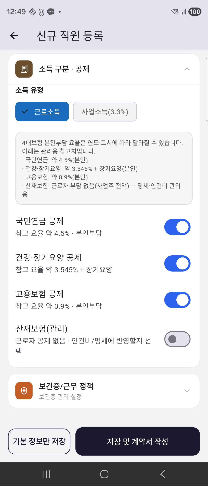
  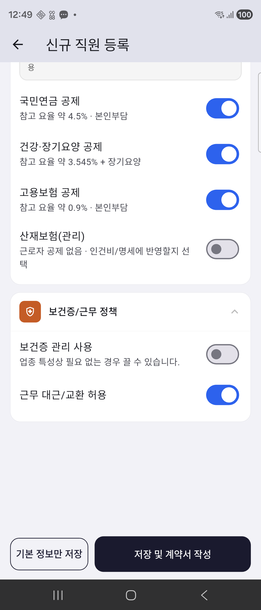

### 🔹 기본 입력 정보
1. **직원 정보**: 이름과 연락처를 남겨주세요. 이후 직원이 폰에서 본인용 파트너 앱(웹링크)으로 접속하려면 연락처 기반 초대 링크 발송이 필요합니다.
2. **급여 및 요일/근무시간 (매우 중요)**
   - **시급**: 2026년 기준 법정 최저임금은 **10,320원**입니다. 기본값이 자동으로 안내됩니다.
   - **휴게 여부**: 유급 휴게인지 무급 휴게인지 명확하게 구분해주세요. (통상적으로 식사시간 등은 무급 휴게입니다.)
   - 💡 **주휴수당 자동 판독**: 요일 아이콘 버튼들을 터치하여 출근 요일을 켜고 시간을 지정하면, 합산된 '주 소정근로시간'을 바탕으로 **주휴수당 달성 요건(15시간 이상 여부)**을 시스템이 자동으로 알려줍니다.

### 🔹 고급 설정 창 (접기/펼치기)
앱 하단에 있는 각 항목의 헤더를 탭하면 세부 설정 화면이 아래로 확장됩니다.

1. **4대보험(사회보험) 설정**
   - 국민연금, 건강보험, 고용보험 가입 여부를 개별적으로 세팅할 수 있습니다.
   - 단시간 근로자, 또는 일용직 근로자의 경우 법정 요건에 맞추어 버튼을 켜주시면, 매월 급여 정산 화면에서 **근로자 부담분이 자동으로 계산되어 급여에서 공제**됩니다.
2. **보건증(건강진단결과서) 관리**
   - 요식업 등 필수 직군의 경우 보건증 발급일과 유효기간(통상 1년) 만료일을 등록할 수 있습니다.
   - 정보를 미리 입력해두시면 만료 전(예: 한 달 전) 대시보드 대관 화면에서 알맞게 푸시 알림 혹은 강력한 경고를 발생시켜 줍니다. 과태료를 완벽히 예방하세요!

> [!TIP]
> 화면 최하단의 **[초대 코드 보내고 등록 완료]** 버튼을 누르시면, 직원이 카카오톡 등의 채널로 본인의 앱 접속용 초대 링크를 전송받게 되면서 즉시 출퇴근 기록 모드로 진입하게 됩니다!

---

## 4. 앱(웹) 초대 보내기

직원 등록 단계의 마지막인 **초대코드 발송 화면**입니다.
가입한 직원이 출퇴근을 기록하거나 본인의 급여 연동을 받으려면, 이 단계에서 발송하는 카카오톡 초대 메시지가 꼭 필요합니다.

  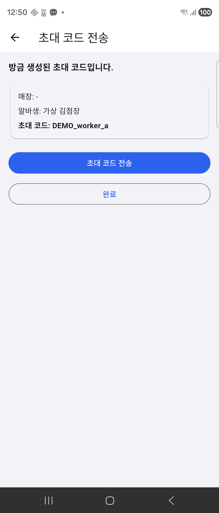

### 🔹 초대 링크 전송 방법
- 화면 하단의 **`카카오톡으로 초대장 보내기`** 버튼을 누르시면, 직원에게 맞춤형 초대장(매장명, 초대 모바일 웹 주소, 비밀번호 포함)이 자동으로 카카오톡 메시지에 꽂힙니다.
- 만약 직원이 카카오톡을 쓰지 않는다면, 그 아래의 **`문자로 초대장 보내기`**를 눌러 SMS 메시지로 전송할 수도 있습니다.
- 💡 **알바 앱 (Alba Web)**
  직원은 별도의 앱스토어 다운로드 없이, 전달받은 링크를 누르기만 하면 즉시 모바일 웹앱 환경에서 휴대폰 본인 인증 후 알바 전용 화면을 볼 수 있습니다.

---

## 5. 필수 노무 서류 자동화 교부

노동부 점검 시 단골 과태료 대상이 되는 각종 법정 서류들을 더 이상 수기로 작성할 필요가 없습니다. 앱에 입력된 매장 및 직원 정보를 바탕으로 PDF 문서 형태로 완벽하게 자동 렌더링됩니다.

### ① 근로자 명부 작성
근로기준법 제41조에 따라 모든 사업장에 비치해야 하는 **'근로자 명부'**입니다. 휴대폰 화면이 작아 전체가 안 보일 경우 아래로 스크롤하여 모든 항목을 확인할 수 있습니다.

  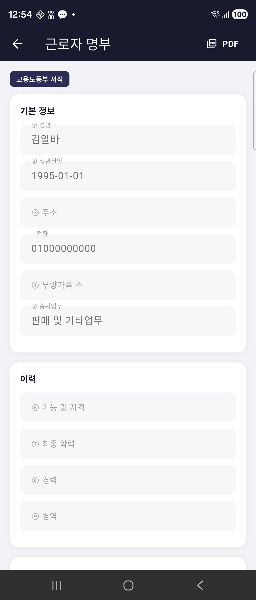
  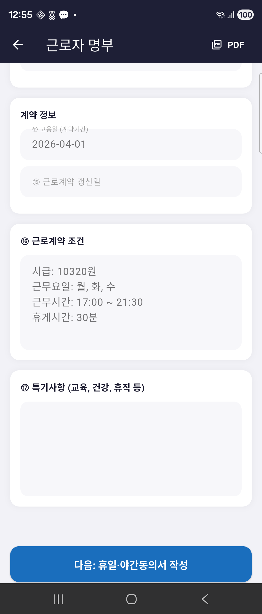

- 직원의 이름, 입사일, 전화번호, 근무 요일 등 최초 등록한 기초 이력 데이터가 원터치로 연동됩니다.
- `[내보내기]`를 통해 문서 형태로 보관해 두시면 완벽한 법적 대비가 가능합니다.

### ② 채용/법정 체크리스트
신규 파트타이머를 채용할 때 점주님이 실수로 누락하기 쉬운 필수 준수 사항들을 리마인드 해주고 점검할 수 있는 서류입니다.

  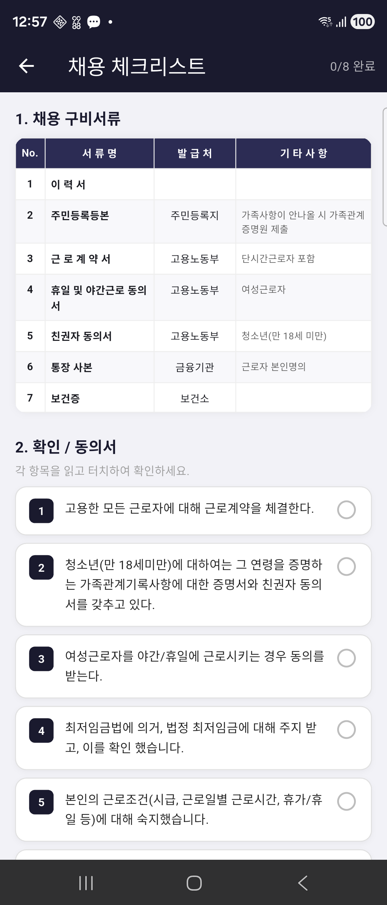
  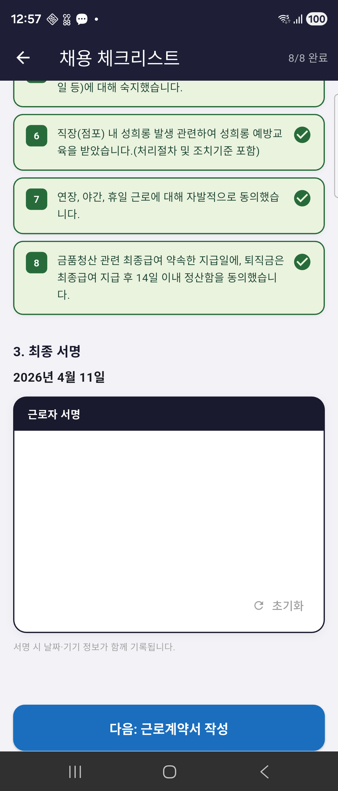

- 근무 전 교육, 안전 수칙 안내, 필수 정보 고지 등의 내역을 확인하고 체크하여 보관할 수 있습니다.
- 문서 하단까지 점검을 마치면 사장님이 법적 절차를 완벽히 정석대로 밟았다는 훌륭한 소명 자료가 됩니다.

### ③ 야간 및 휴일근로 동의서
근로계약서에 앞서, 밤 10시부터 새벽 6시 사이의 근로나, 휴일에 근로시킬 수 있다는 사전 동의를 받는 필수 문서입니다. (미작성 시 분쟁 소지 방지)

  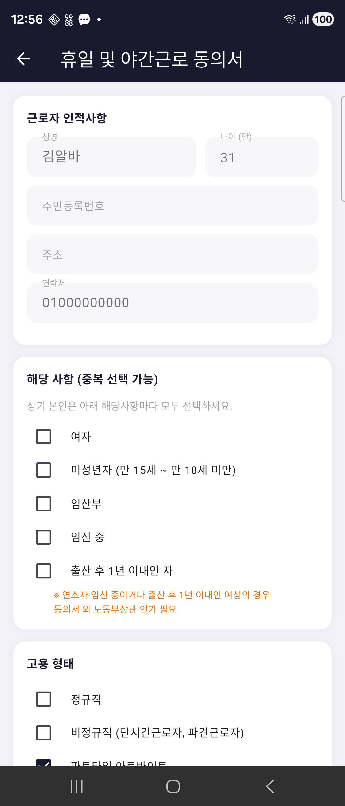
  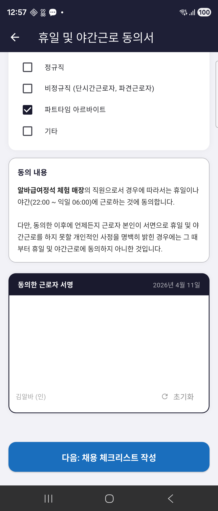

- 야간 근무가 포함된 직원이라면 반드시 교부해야 하는 서류입니다.
- 서명 란에 직원과 사장님의 서명이 전자적으로 입력되면 대시보드 서류 보관함에 즉시 영구 저장되어 언제든 증빙자료로 사용할 수 있습니다.

### ④ 전자 근로계약서 자동 생성
노무 문서 중 가장 중요한 **표준 근로계약서**입니다. 스마트폰의 작은 화면에 맞춰 최적화된 UI로 깔끔하게 제공됩니다.

  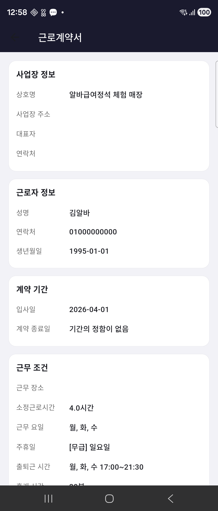
  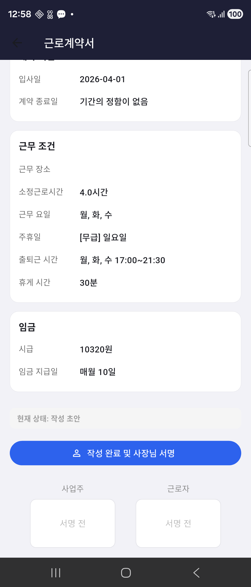

- **자동 완성 항목**: 계약 기간, 근무 장소, 업무 내용, 소정근로시간, 임금(시급/주휴수당), 연차유급휴가 규정 등 필수 기재 사항이 앞서 입력한 데이터를 바탕으로 오차 없이 조립됩니다.
- **교부 의무 완벽 준수**: 서명 완료된 계약서는 사장님과 알바생 양쪽 앱에 보관되며 법정 의무 보존 기간(퇴사 후 3년)까지 안전하게 관리됩니다.

---

## 6. 직원(알바 웹)에서의 서류 확인 및 서명

사장님 앱에서 발송한 근로계약서 및 각종 동의서를 직원이 어떻게 전달받고 서명하는지 확인하는 파트너(직원) 전용 화면입니다.

  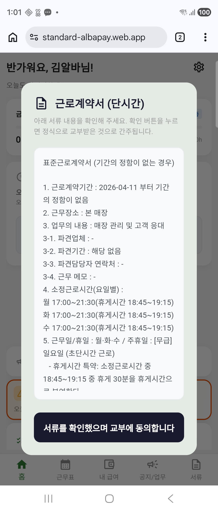

### 🔹 비대면 전자 서명 시스템
- 직원은 URL(알바웹)을 누른 뒤 복잡한 가입 없이 휴대폰 인증만으로 전용 알바 대시보드에 진입합니다.
- 대시보드의 **[노무 서류 확인]** 탭에 들어가면 사장님이 발송한 근로계약서 팝업이 노출됩니다.
- 직원은 내용을 꼼꼼히 확인하고, 자신의 **전자 서명(스마트폰 터치 사인)**을 진행합니다.
- 직원이 서명을 완료하는 즉시, 사장님 앱의 해당 서류 상태가 [서명 완료]로 자동 업데이트되며 비대면 교부 의무가 100% 충족됩니다!

 
 

# [ 제2부. 앱 핵심 화면 구성 및 일상 관리 ]

## 7. 메인 홈 (대시보드)

로그인 후 매일 가장 먼저 확인하시게 될 사장님 앱의 **핵심 관제탑(Dashboard)** 화면입니다. 스마트폰 화면을 좌우로 스와이프하여 여러 개의 브리핑 카드와 급여 리포트까지 연결해서 확인하실 수 있습니다.

  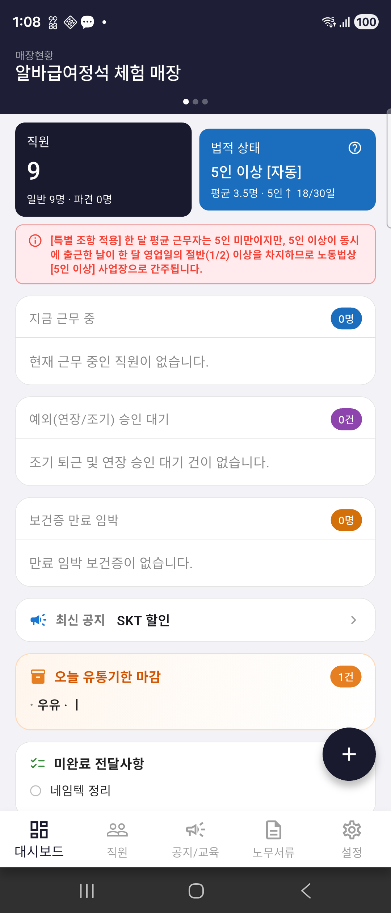
  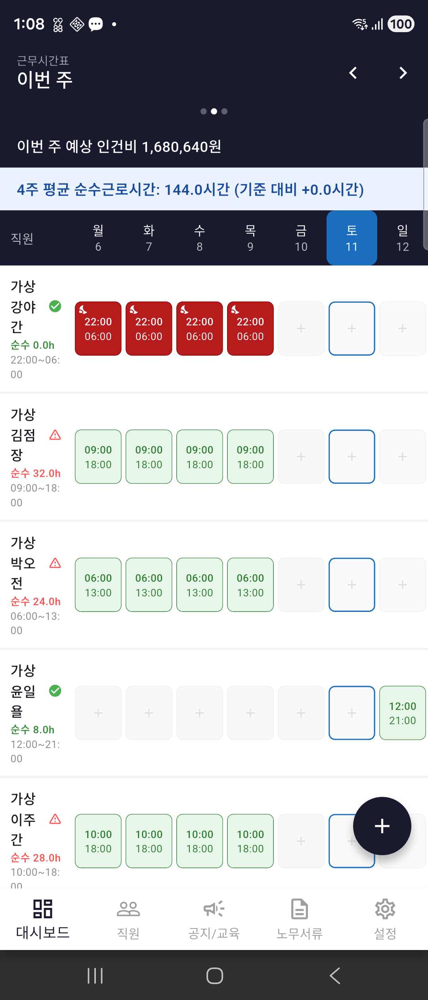
  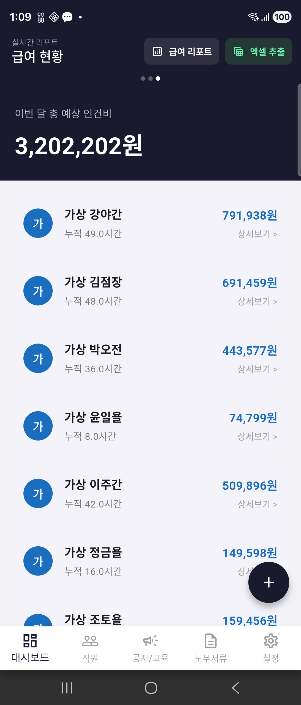

  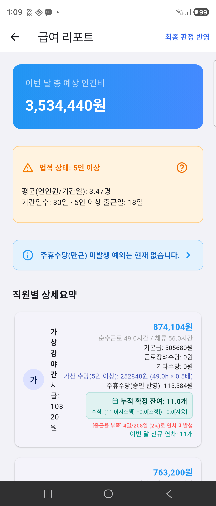
  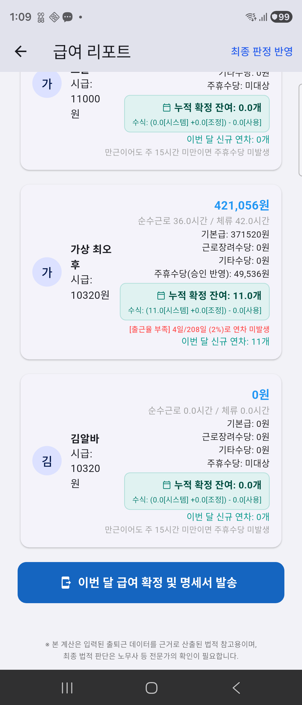

### 🔹 핵심 요약 카드 (상단부, 좌/우 스와이프)
매장 운영과 관련해 사장님이 즉각적으로 인지해야 하는 중요 알림들이 카드뷰 형태로 펼쳐집니다. 
- **긴급/주의 알림**: 보건증 만료 임박, 근로계약서 미작성 경고 등 당장 처리해야 할 컴플라이언스 이슈를 알려줍니다.
- **할 일 목록**: 오늘 출근할 직원이 누구인지, 서명이 필요한 결재류가 있는지 등을 스마트하게 요약하여 브리핑해줍니다.
- 마지막 슬라이드인 **[급여 브리핑/리포트]** 카드를 통해 이번 달 인건비와 주휴수당 예상치를 대시보드 위젯 상에서도 빠르게 요약 형태로 확인할 수 있습니다.
- 해당 카드를 터치하면 즉시 관련 상세 메뉴로 이동하여 신속한 조치가 가능합니다.

### 🔹 실시간 출퇴근 관리
가장 눈에 잘 띄는 곳에 현재 매장에서 실시간으로 일하고 있는 직원의 명단과 누적 근무 시간이 투명하게 공개됩니다.
- 알바생이 본인의 기기(알바웹)에서 출근 버튼을 누르는 즉시 사장님 화면에도 실시간으로 타이머가 돌아갑니다.
- 지각 여부나 휴게 시간 사용 유무도 이 화면에서 최우선으로 파악하실 수 있습니다.

---

## 8. 급여 리포트 및 상세 내역 관리

대시보드의 브리핑 카드에서 더 깊게 들어가면 볼 수 있는 메뉴로, 사장님들의 가장 큰 페인포인트를 완벽하게 해결해 주는 메뉴입니다. 아래로 스크롤하여 모든 세부 항목의 명세 내역을 확인할 수 있습니다.

  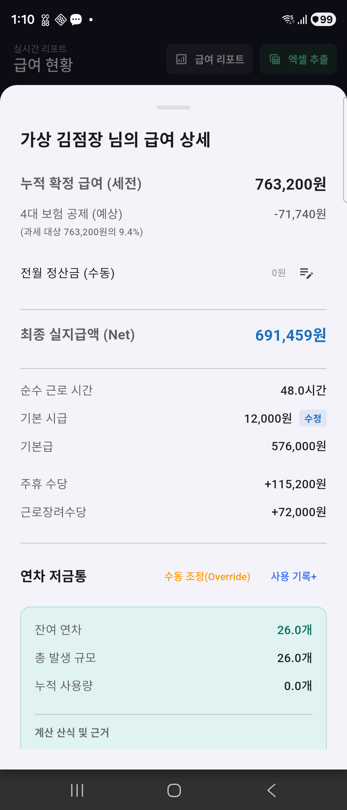
  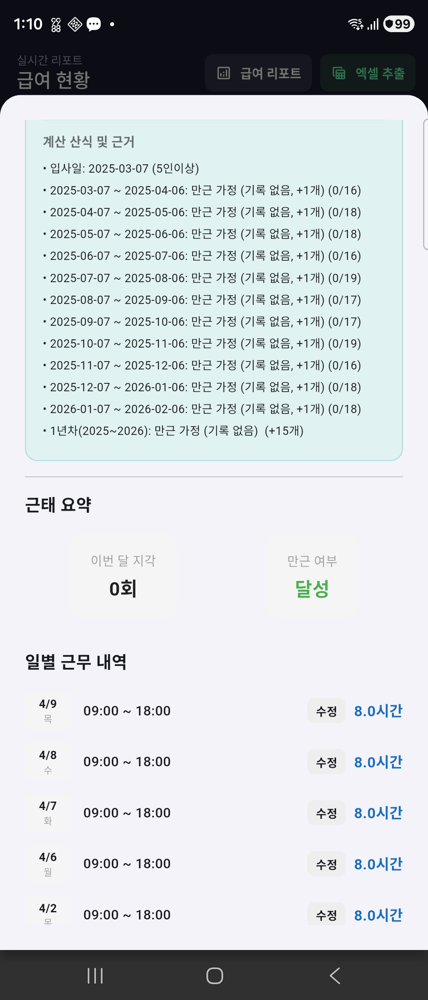
  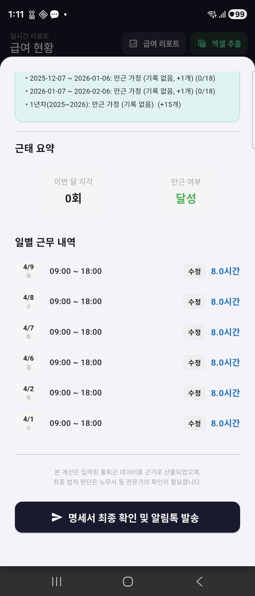

### 🔹 자동화된 법정 수당 계산
- 직원의 실제 출퇴근 기록을 바탕으로 **주휴수당, 연장/야간/휴일근로 수당**이 한 치의 오차 없이 자동 산출됩니다.
- 추가 지급액이나 차감액이 있다면 상세 내역 화면에서 손쉽게 편집(조정)할 수 있습니다.
- 4대 보험 공제, 소득세 원천징수 등 복잡한 세금 계산도 시스템이 알아서 공제해 줍니다. 급여 명세서 생성 버튼 한 번이면 끝납니다!

 
 

# [ 제3부. 직원용 알바 웹(Alba Web) 활용 가이드 ]

## 9. 알바 전용 대시보드 및 실시간 출퇴근

직원들이 자신의 휴대폰에서 링크를 눌러 가장 자주 접하게 되는 모바일 웹 기반 메인 화면입니다. 사장님 앱과 실시간으로 연동되어 투명하고 정확한 근무 관리를 지원합니다.

  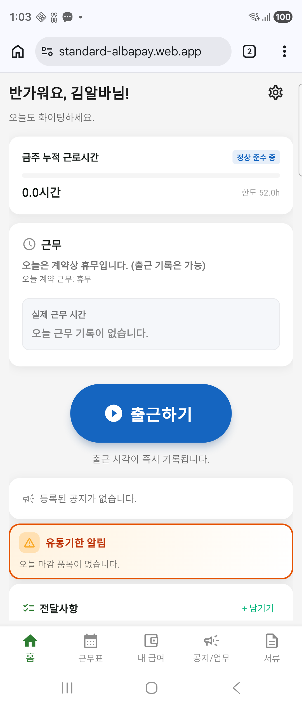

### 🔹 간편한 QR 카메라 출퇴근 기록
- 매장에 비치된 알바급여정석 전용 QR코드를 직원 폰의 **[카메라로 스캔(찍기)]**만 하면 복잡한 조작 없이 단 1초 만에 **출근하기/퇴근하기** 처리가 완료됩니다!
- 출퇴근 처리되는 즉시 사장님 앱의 메인 대시보드에도 실시간으로 출근 상태와 타이머가 연동되어 분쟁의 소지가 원천 차단됩니다.

### 🔹 이번 달 누적 급여 모니터링
- 직원이 자신이 일한 시간만큼, 주휴수당 및 세금을 포함한 예상 세후 급여를 직관적으로 확인할 수 있습니다.
- 사장님이 매번 "이번달 얼마야?" 하는 질문에 답할 필요 없이 직원이 스스로 납득하고 언제나 조회가 가능합니다.

### 🔹 내 스케줄 간편 조회
- 곧 다가올 본인의 다음 출근 요일과 스케줄(출퇴근 예정 시간)을 첫 화면에서 놓치지 않고 바로 확인할 수 있습니다. 미리 휴무 신청이나 대타 관리도 이 화면에서 연결됩니다.

---

## 10. 내 근무표 및 스케줄 확인

직원이 본인의 월간/주간 근무 일정을 달력 형태로 한 눈에 파악할 수 있는 화면입니다. 아래로 스크롤하여 더 많은 상세 일정을 조회할 수 있습니다.

  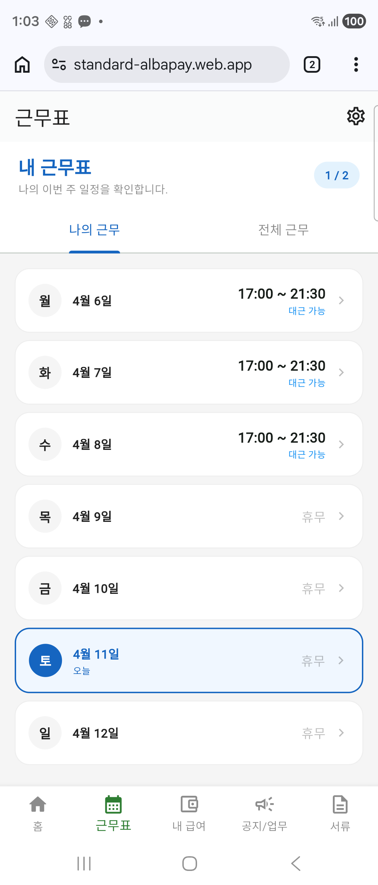
  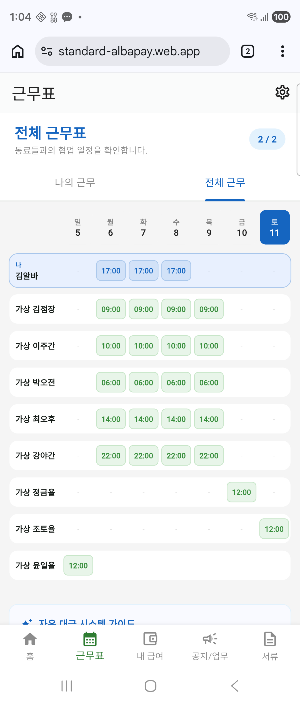

### 🔹 캘린더 기반 일정 관리
- 본인이 출근해야 하는 날짜와 시간이 달력에 예쁘게 마킹되어 있어, 개인 일정(학교, 학원 등)과 알바 스케줄을 헷갈리지 않고 조율할 수 있습니다.
- 사장님이 앱에서 급하게 일정을 변경하더라도 직원 웹 캘린더에 실시간으로 즉시 반영됩니다.

### 🔹 대타 및 휴무 신청 (예정)
- 피치 못할 사정으로 결근해야 할 때, 이 화면에서 사장님께 직접 '휴무 신청'을 하거나 동료들에게 '대타 요청'을 올릴 수 있도록 스케줄링의 편의성을 극대화했습니다. (사장님 승인 후 최종 반영)

---

## 11. 내 급여 상세 내역 확인

직원이 단순히 예상 급여액만 보는 것을 넘어, 자신이 이번 달 일한 모든 내역과 공제된 세금 등을 사장님과 100% 동일한 기준으로 확인할 수 있는 투명한 급여 조회 화면입니다. 아래로 스크롤하여 더 많은 상세 계산법을 확인할 수 있습니다.

  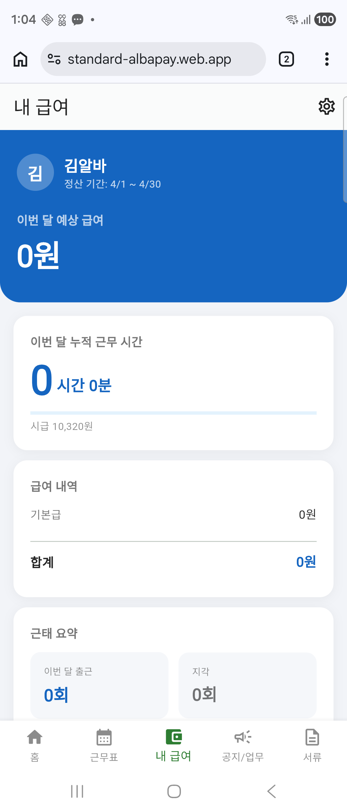
  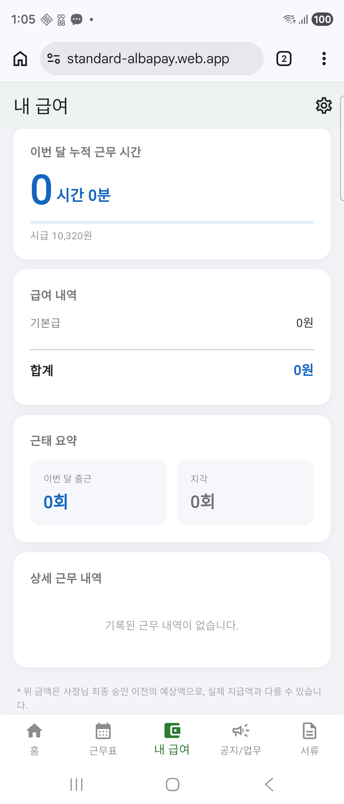

### 🔹 투명한 급여 명세 및 수당 내역
- 내가 몇 시간 일해야 받을 수 있는 기본급은 물론, 15시간 이상 근무하여 발생한 **주휴수당**이나 야간/연장 **가산수당**까지 상세하게 풀어서 보여줍니다.
- 사장님이 별도로 종이 명세서를 뽑아주지 않아도, 앱 캡처 한 장으로 급여 명세서 교부 의무를 갈음할 수 있는 강력한 기능입니다.

### 🔹 4대 보험 및 세금 공제 확인
- 내가 내야 하는 4대 보험 원천징수액이나 프리랜서 소득세(3.3%)가 얼마인지 정확히 명시되어, "이 금액이 왜 깎였죠?"라는 직원의 문의를 원천봉쇄합니다.

---

## 12. 공지사항 및 업무별 교육 매뉴얼

알바생들이 업무에 투입되기 전 혹은 근무 중에 수시로 참고할 수 있는 사내 게시판/업무 가이드 화면입니다.

  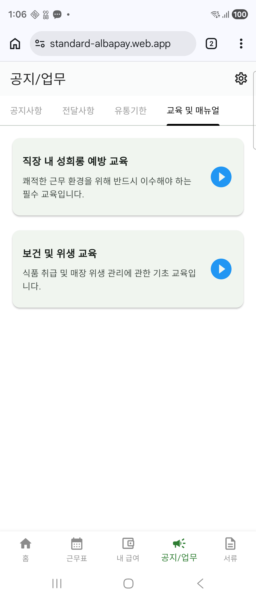

### 🔹 꼼꼼한 업무 온보딩 (Onboarding)
- 매장의 인사말부터 시작해, 포스(POS)기 사용법, 재료 준비 방법 등 사장님이 올려둔 **'매장 맞춤형 업무 매뉴얼 및 동영상/이미지 가이드'**를 열람할 수 있습니다.
- 알바생이 바뀔 때마다 똑같은 설명을 반복하던 사장님의 번거로움을 획기적으로 줄여주고, 신규 직원의 빠른 적응을 돕습니다.

---

## 13. 내 노무 서류 보관함

직원이 본인과 관련된 모든 법정 노동 서류를 언제든 열람할 수 있도록 제공되는 안전한 전자 문서고(Vault)입니다.

  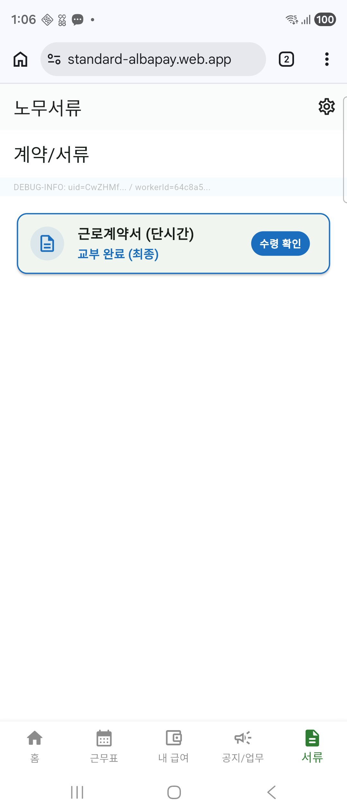

### 🔹 안전한 계약 문서 열람
- 입사 시 작성했던 '근로계약서' 및 '휴일/야간 근로 동의서' 원본을 분실 걱정 없이 언제든지 꺼내 볼 수 있습니다.
- 사장님이 직접 서명하고 인증한 문서가 반영구적으로 저장되므로 알바생들이 신뢰감을 갖고 일할 수 있습니다.
